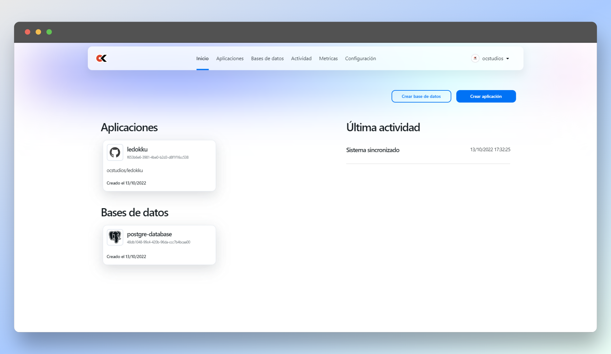
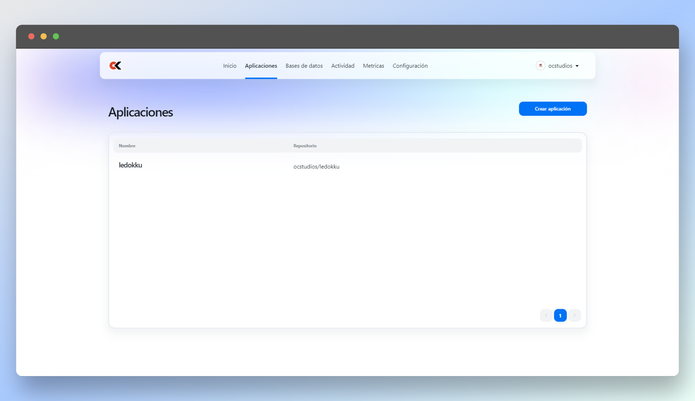
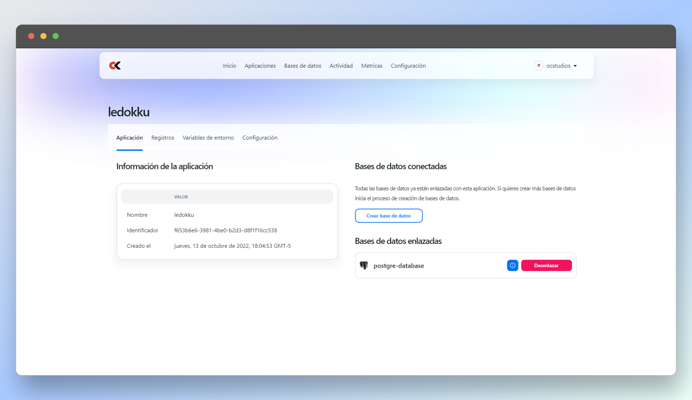
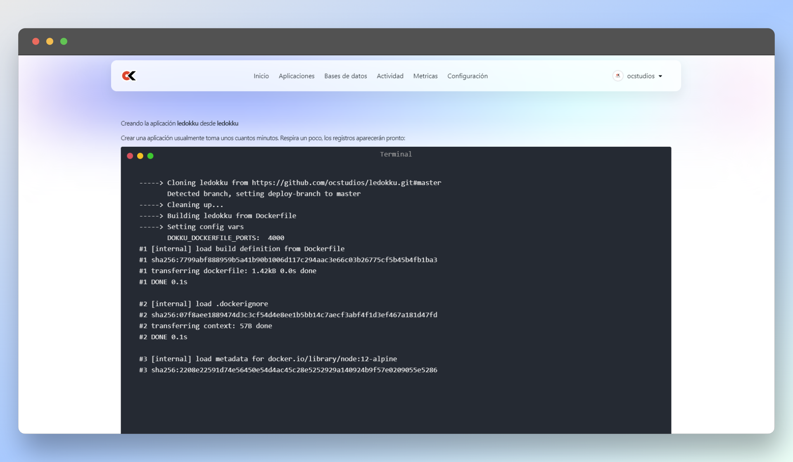

# Ledokku Fork - Beautiful web UI for all things Dokku
##### Migrated and maintained by Overclock Studios SA de CV

## Preview

    
    
    
    

Ledokku is a beautiful UI powered by [Dokku](http://dokku.viewdocs.io/dokku/)

With Ledokku you will be able to deploy apps written in:
**Node js, PHP, Ruby and many more**.

And link them with most popular databases: **PostgreSQL, MongoDB, Redis**.

## Just few clicks and your app is live

- Install Ledokku on your Dokku server
- Deploy your app using the Dokku workflow
- Create and link your db (PostgreSQL, mongoDB, redis)
- App is live 🎉🎉🎉

## Getting started guide

Want to try Ledokku out yourself? Head to our [getting started guide](https://www.ledokku.com/docs/getting-started)

## Our vision

We started to work on this because current deployment solutions were expensive or hard to configure. With Ledokku we plan to provide a solution where deployment experience is smooth, enjoyable and affordable.

## MVP

To get initial feedback we are working on the MVP state where current Dokku users will be able to use the web ui of Ledokku while keeping control of their server. It will allow us to gather feedback from active Dokku users and shape the future of Ledokku.

## MVP features

- Beautiful web ui
- Common app management (create, delete, stop)
- Env variables management (set, unset, edit)
- Databases management (create, delete, link)
- Explore app logs

### Built with

- Dokku 🐳
- Node.js 💚
- TypeGraphQL 💓
- Prisma △
- TypeScript 💙
- NextUI 💄
- GithubAPI 🐱
- Tailwind CSS 🌪
- Docusaurus 🦖
- Docs hosted on [Netlify](https://www.netlify.com/)

## Contributing

Read our [contributing guide](CONTRIBUTING.md) to see how to locally setup the repository and see our development process.

## Made by

[Leo](https://github.com/pradel),
[Arturs](https://github.com/Akirtovskis)

## License

Ledokku is licensed under the [MIT license](https://github.com/ledokku/ledokku/blob/master/LICENSE).
